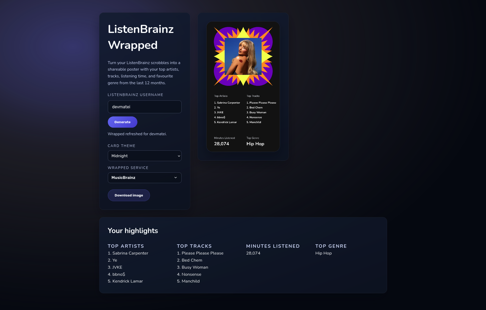

# 🎧 ListenBrainz Wrapped

wrapped generator for listenbrainz built with flask
 
 
 


## 🌐 website

https://wrapped.devmatei.com/

## 💡 why it’s cool

* grabs data from listenbrainz, musicbrainz, cover art archive and wikidata — all public, no tokens (unlesssssssss u want last.fm)
* artist art uses last.fm first, then falls back to musicbrainz/wikidata — and if that fails, there’s a built-in editor so you can upload/zoom/position your own artwork (saved in local storage or temporarily on the server for 1 hour)
* image requests flow through a tiny queue + rate limiter so your homelab doesn’t melt when friends hammer the endpoint after you share it
* there’s a live counter of total wraps ever generated, persisted via a tiny text file so the tally survives restarts

## ⚡ quickstart

```bash
python3 -m venv .venv && source .venv/bin/activate
pip install -r requirements.txt
```

copy `.env.example` to `.env` and tweak the basics:

```
FLASK_ENV=production
SECRET_KEY=<something>
LASTFM_API_KEY=<your-lastfm-key>
# set HTTP_PROXY / HTTPS_PROXY if you tunnel through a proxy
```

run it

```bash
gunicorn -w 4 -b 0.0.0.0:8000 wrapped-fm:app
```

or locally

```bash
./start.sh <host> <port>
```

### 🧠 production

* reverse proxy + https
* `APP_TRUST_PROXY_HEADERS=1` if proxying
* `APP_RATE_LIMIT_SALT` = random string
* 1 worker per instance unless you know what you’re doing
* add `FLASK_DEBUG=0`, `PYTHONUNBUFFERED=1`, `LOG_LEVEL=info`

## ⚙️ config

### core

`LISTENBRAINZ_API=https://api.listenbrainz.org/1`
`MUSICBRAINZ_API`, `COVER_ART_API`
`LISTENBRAINZ_RANGE=year`
`AVERAGE_TRACK_LENGTH_MINUTES`, `COVER_ART_LOOKUP_LIMIT`

### integrations

`LASTFM_API_KEY` – better artist images
`LASTFM_API`, `LASTFM_USER_AGENT`

### performance

`HTTP_TIMEOUT`, `HTTP_POOL_MAXSIZE`, `LISTENBRAINZ_CACHE_TTL`, `LISTENBRAINZ_CACHE_SIZE`
`APP_RATE_LIMIT`, `APP_STATS_RATE_LIMIT`, `APP_IMAGE_RATE_LIMIT`, `APP_MAX_TOP_RESULTS`
`APP_IMAGE_CONCURRENCY`, `APP_IMAGE_QUEUE_LIMIT`, `APP_IMAGE_QUEUE_TIMEOUT`
`TEMP_ARTWORK_TTL_SECONDS`, `TEMP_ARTWORK_MAX_BYTES`
`WRAPPED_COUNT_FILE` (defaults to `data/wrapped-count.txt`)
`WRAPPED_COUNT_SINCE` – label for when you started counting wraps (ISO date string)
`APP_RATE_LIMIT_SALT`, `APP_TRUST_PROXY_HEADERS`

### why it exists

Yeah, the idea is for people whose friends all use Spotify and post their Wrapped. When you share a ListenBrainz one everyone replies “wait, what’s that?”—so this bridges the gap. I swapped Spotify for Navidrome but still wanted that wrapped-moment vibe.

Share [wrapped.devmatei.com](https://wrapped.devmatei.com), flex your open music stats, and maybe convince someone to try self-hosting—or at least start a nerdy chat.

### about me

I’m Matei (aka [DevMatei](https://devmatei.com)) — a full-stack dev who loves shipping playful web tools, tinkering with AI and homelab setups, streaming on Twitch, and yes, drinking an obscene amount of tea. If you want to talk projects, self-hosting, or just nerd out, hit the email on my site or ping me on socials.

### frontend

uses [anime.js](https://animejs.com/) cuz it’s smooth as hell

## 🤝 contributing

See [CONTRIBUTING.yml](./CONTRIBUTING.yml) for setup steps, coding style notes, and the pull-request checklist. TL;DR: keep PRs focused, run `python -m py_compile wrapped-fm.py`, and drop screenshots for any UI tweaks.

## 🧩 to-do

* [ ] navidrome support for self-hosters
* [ ] faster wrapped rendering
* [ ] make code modular and readable (maybe)

originally made for last.fm by [jeff parla](https://github.com/parlajatwit) <3
my code is unreadable but it works 😭

## 📜 license

AGPL-3.0 — share alike

Note: This project isn’t affiliated with or endorsed by Spotify, ListenBrainz, or MusicBrainz. It’s just a fan-made thing built for fun.
